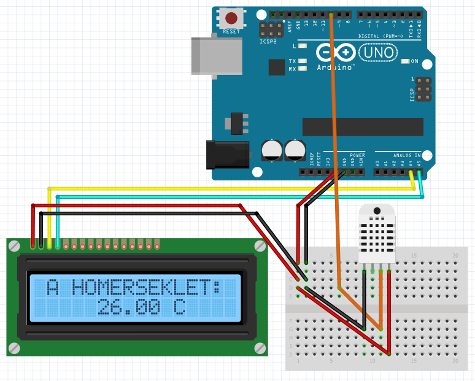

# Arduino_DHT11

## Humidity and Temperature measurement using the DHT11 sensor, displaying the values on an I2C LCD displaying

Here's an image of the circuit

- [X] Arduino 
- [X] Git
- [X] Sourcetree